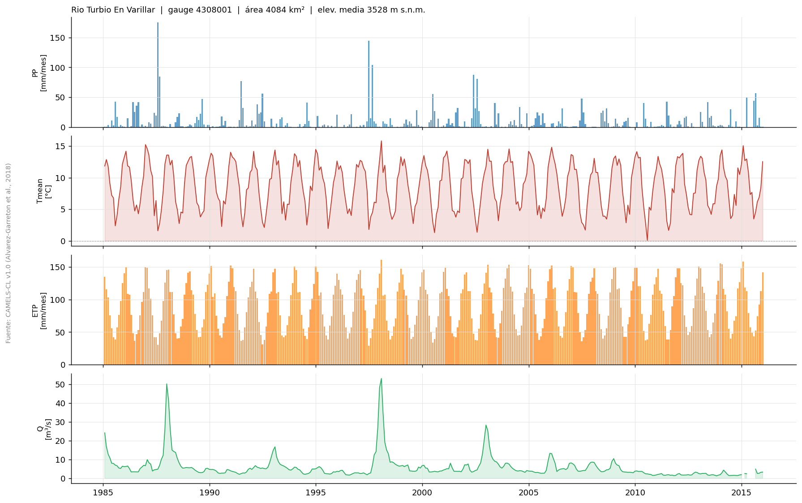

# camels-cl-loader

Python loader for **CAMELS-CL v1.0** — 516 Chilean catchments with daily
streamflow, precipitation, temperature, and PET time series.

Data source: [PANGAEA](https://doi.org/10.1594/PANGAEA.894885)  
Reference: Alvarez-Garreton et al. (2018). *The CAMELS-CL dataset*. HESS 22(11).

---

## Features

- Downloads directly from PANGAEA (no intermediate mirrors needed)
- Local ZIP cache — each file is downloaded only once
- Optional Parquet cache for fast repeated reads
- Simple, dependency-light API (`numpy`, `pandas`)

## Installation

No package installation required. Copy `src/loader_camels.py` to your project
and import it directly.

Dependencies: `numpy`, `pandas`, `pyarrow` (optional, for Parquet cache)

## Quick start

```python
from pathlib import Path
from loader_camels import listar_cuencas, cargar_forzantes, cargar_caudal

CACHE = Path("C:/tmp/camels_cache")   # ZIPs are stored here

# Browse catchments
cat = listar_cuencas(CACHE)
print(cat[cat["nombre"].str.lower().str.contains("turbio")])

# Load daily forcing data
fz = cargar_forzantes(CACHE, gauge_id="4308001",
                      inicio="1985-01-01", fin="2015-12-31",
                      variables=["precip_cr2", "tmean_cr2", "etp_har"])

# Load daily streamflow
q = cargar_caudal(CACHE, gauge_id="4308001",
                  inicio="1985-01-01", fin="2015-12-31")
```

## Preview



## Notebook

`notebooks/exploracion_camels.ipynb` — interactive walkthrough:

| Step | Action |
|------|--------|
| 1 | Search catchment by name |
| 2 | Inspect metadata |
| 3 | Set period and variables |
| 4 | Check data coverage |
| 5 | Visualize time series and climatology |

## Available variables

| Key | Description | Units |
|-----|-------------|-------|
| `precip_cr2` | Daily precipitation (CR2MET) | mm |
| `tmean_cr2` | Mean daily temperature (CR2MET) | °C |
| `tmin_cr2` | Min daily temperature (CR2MET) | °C |
| `tmax_cr2` | Max daily temperature (CR2MET) | °C |
| `etp_har` | PET Hargreaves | mm |
| `swe` | Snow water equivalent | mm |
| `q_m3s` | Observed streamflow (DGA) | m³/s |
| `q_mm` | Observed streamflow (area-normalized) | mm/d |

## Dataset versions

This loader targets **CAMELS-CL v2018** distributed via PANGAEA. A newer version is available directly from CR2:

**CAMELS-CL v202201** — [cr2.cl/download/camels-cl-v202201](https://www.cr2.cl/download/camels-cl-v202201/)

| | v2018 (PANGAEA) | v202201 (CR2) |
|---|---|---|
| Series through | ~2018 | April 2020 |
| Precipitation products | CR2MET | CR2MET, CHIRPS, MSWEP, TMPA |
| Distribution | Per-variable ZIPs | Single ZIP with CSVs |
| Catchment boundaries | — | Shapefile included |
| Attributes | `area`, `elev_mean` | `area_km2`, `mean_elev` |

This loader is **not compatible** with v202201 due to format differences.

## License

Data: CC BY 4.0 — cite Alvarez-Garreton et al. (2018).  
Code: MIT.
